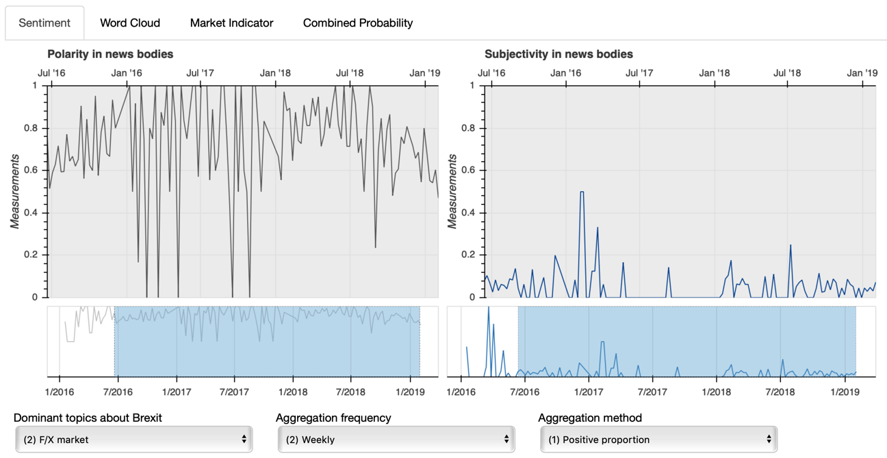
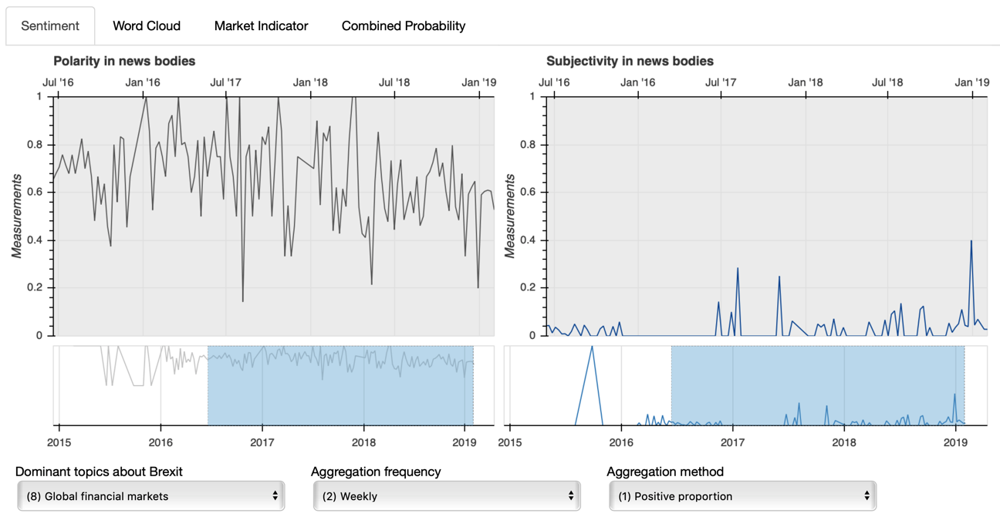
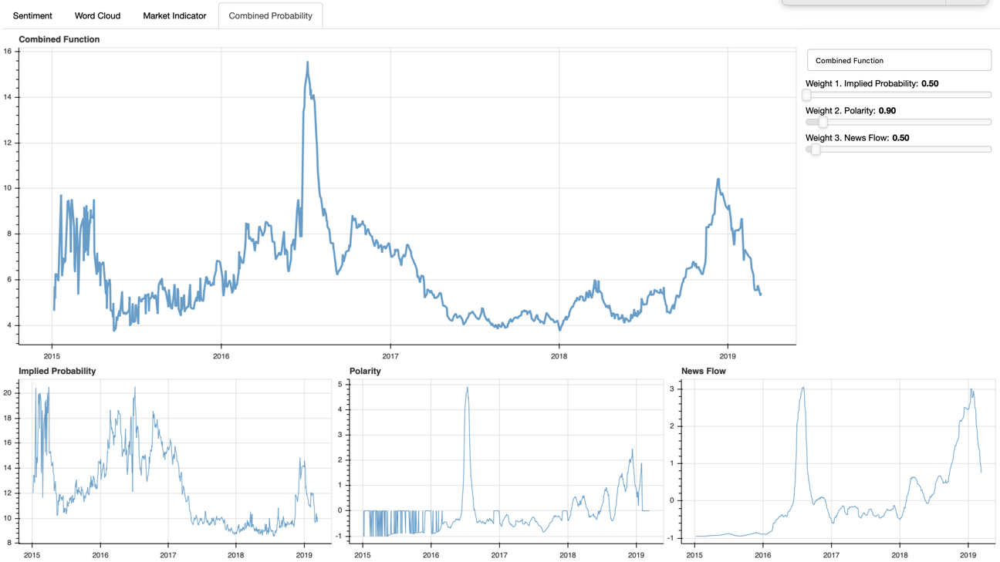
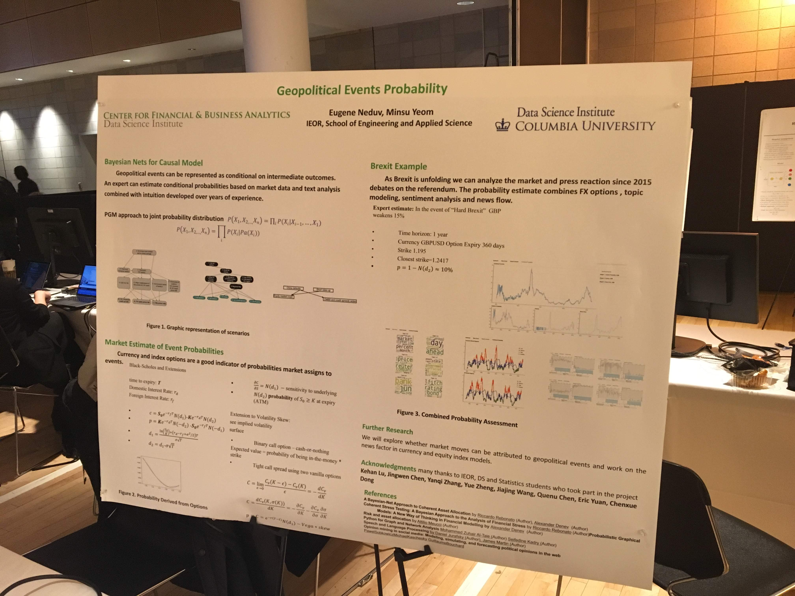
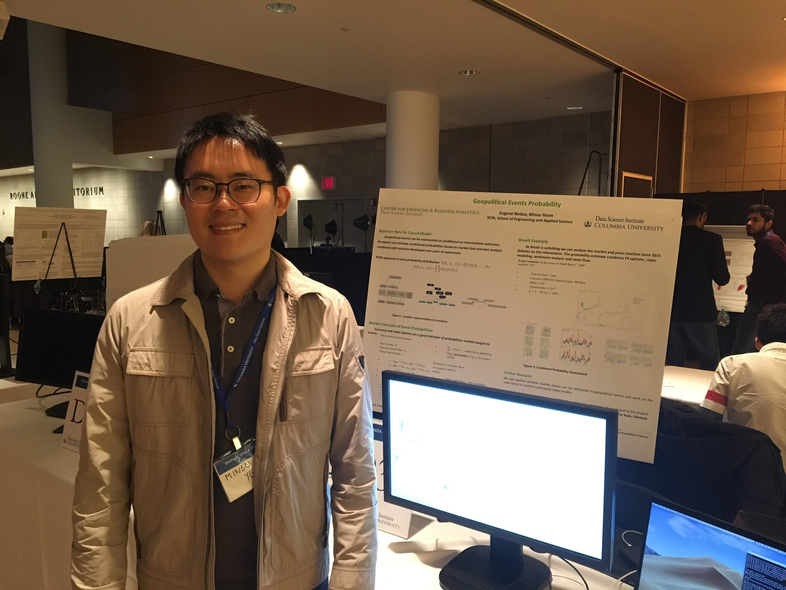

# Dashborad
#### Visualizing a research project on predicting the GBPUSD rate, supervised by [Eugene Neduv](https://datascience.columbia.edu/eugene-neduv)
- Features are *sentiment scores* and volumes in news articles, and option-implied volatility.
  - *sentiment scores* is defined as a normalized number of news sentiment.
  - We gathered all news with *Brexit* tags from Reuter news archive from 2015 to 2018.
- We take those three features and express them as a combined probability function
#### Used [Bokeh](https://bokeh.pydata.org/en/latest/index.html) and ran a Bokeh server on my laptop
#### My responsibilities include
- writing this dashboard from the scratch.
- consolidating and verifying existing works.

## Screenshots

### Two Plots on Sentiment Analyses
#### 1)Sub-topic: F/X Market
- **Aggregation frequency**: Weekly
- **Aggregation method**: Proportion of positive news
- This sub-topic was manually identified after applying *topic modeling*

#### 2)Sub-topic: Global Financial Market
- **Aggregation frequency**: Weekly
- **Aggregation method**: Proportion of positive news

### A Plot on Combined Probability
- Top: combined probability function with sliding bars for various weights applied to this function
- Bottom: three features are plotted
  - Option-implied volatility, sentiment scores (polarity), news volumes in order (left to right)

## Photos 
- Date: April 3, 2019
- Presented on [Data Science day at Columbia University](https://guidebook.com/guide/157509/poi/11818051/?pcat=801110)

